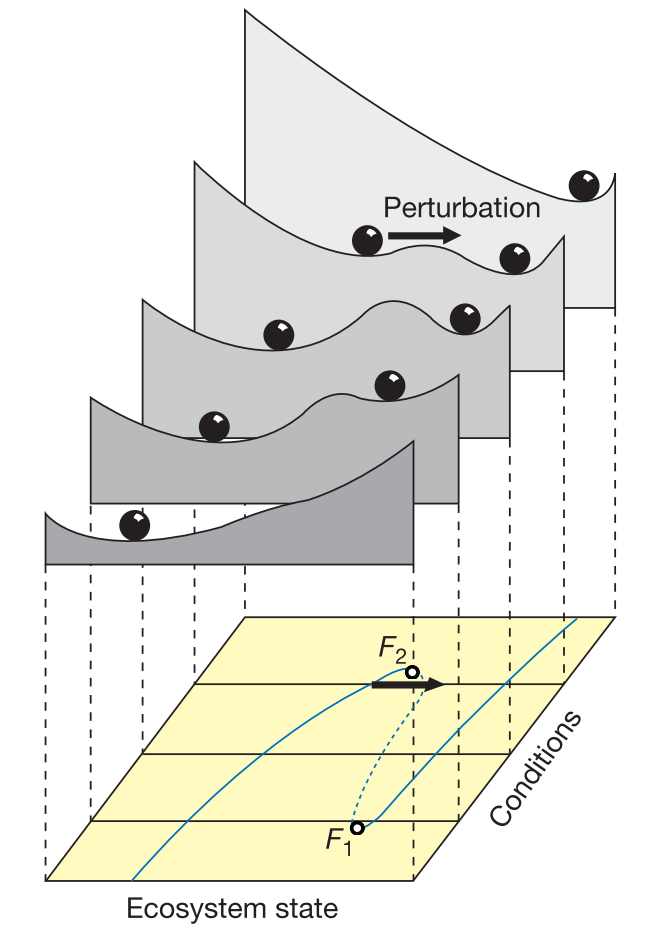
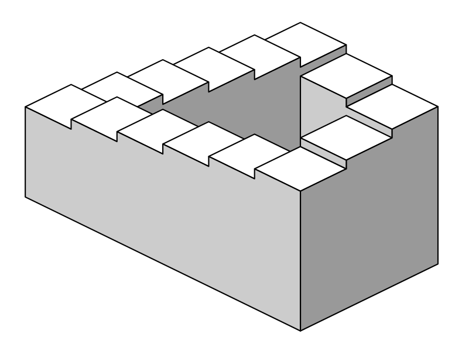
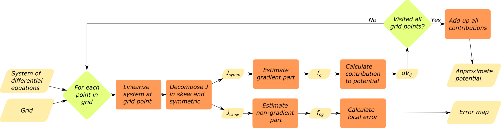

```{r setup, include = FALSE}
knitr::opts_chunk$set(
  collapse = TRUE,
  echo = FALSE,
  warning = FALSE,
  message = FALSE,
  fig.pos = "H"
)
```

```{r Libraries, include = FALSE}
library(rolldown) # Our algorithm
library(ggplot2) # For plotting
library(rootSolve) # For finding equilibria

# For calls to Python's matplotlib
library(reticulate)
matplotlib <- import("matplotlib", convert = TRUE)
matplotlib$use("Agg")
```

```{python, Auxs, echo = FALSE}
import matplotlib.pyplot as plt
from mpl_toolkits.axes_grid1 import make_axes_locatable
import numpy as np
import pandas as pd

def custom_stream(ax, f, xs, ys, title = '', **kwargs):

  roiX = np.linspace(np.min(xs), np.max(xs))
  roiY = np.linspace(np.min(ys), np.max(ys))

  X, Y = np.meshgrid(roiX, roiY)
  [U, V] = f((X, Y))

  c = ax.streamplot(X, Y, U, V, **kwargs)
  ax.set_xlim(roiX[0], roiX[-1])
  ax.set_ylim(roiY[0], roiY[-1])

  ax.set_title(title)
  ax.set_aspect('equal', 'box')

  return ax

def custom_skeleton(ax, f, xs, ys, eqs, title = 'Phase plane', xlabel = '', ylabel = '', alpha_eqs = 1, color = 'black', rotation = 0, **kwargs):

  ax = custom_stream(ax, f, xs, ys, color = color, title = title, **kwargs)
  ax = custom_eqs(ax, eqs, alpha_eqs)

  ax.set_xlabel(xlabel, fontsize = 16, rotation = rotation)
  ax.set_ylabel(ylabel, fontsize = 16, rotation = rotation)

  return ax

def custom_eqs(ax, eqs, alpha_eqs = 1, **kwargs):
  filter = (eqs['equilibrium'] == 'stable')
  eqs_stable = eqs[filter]

  filter = (eqs['equilibrium'] == 'unstable')
  eqs_unstable = eqs[filter]

  ax.scatter(eqs_stable['x_eq'], eqs_stable['y_eq'], color = (0, 0, 0, alpha_eqs))
  ax.scatter(eqs_unstable['x_eq'], eqs_unstable['y_eq'], color = (1, 1, 1, alpha_eqs), edgecolors = (0, 0, 0, alpha_eqs))

  return ax

def custom_contourf(ax, f, xs, ys, zs, eqs, alpha_eqs = 1, alpha_skeleton = 0.0, density = 1, title = '', xlabel = '', ylabel = '', cmap = 'RdYlGn_r', origin = "upper", **kwargs):

  roiX = np.linspace(np.min(xs), np.max(xs))
  roiY = np.linspace(np.min(ys), np.max(ys))

  X, Y = np.meshgrid(roiX, roiY)
  [U, V] = f((X, Y))

  c = ax.contourf(xs, ys, np.transpose(zs), cmap = cmap, origin = origin, **kwargs)
  ax = custom_skeleton(ax, f, xs, ys, eqs, alpha_eqs = alpha_eqs, color = (0, 0, 0, alpha_skeleton), density = density)
  ax.set_xlim(roiX[0], roiX[-1])
  ax.set_ylim(roiY[0], roiY[-1])
  ax.set_title(title)
  ax.set_xlabel(xlabel)
  ax.set_ylabel(ylabel)

  ax.set_aspect('equal', 'box')

  return ax, c

def custom_plot(f, xs, ys, Vs, err, eqs, levels_V = 14, levels_Err = 14, alpha_skeleton = 0.0, density_stream = (0.5, 0.5), cmap_V = 'RdYlGn_r', cmap_err = 'RdYlGn_r'):
  """ Used to generate nice matplotlib plots """

  fig, (ax0, ax1, ax2) = plt.subplots(1, 3)

  ax0 = custom_skeleton(ax0, f, xs, ys, eqs, density = density_stream[0], color = "black")
  ax1 = custom_contourf(ax1, f, xs, ys, Vs, eqs, density = density_stream[1], alpha_skeleton = alpha_skeleton, title = "Quasi-potential", levels = levels_V, cmap = cmap_V)
  ax2 = custom_contourf(ax2, f, xs, ys, err, eqs, density = density_stream[1], alpha_skeleton = alpha_skeleton, title = "Relative error", levels = levels_Err, cmap = cmap_err)

  plt.tight_layout()
  plt.show()

```

# Introduction
With knowledge becoming progressively more interdisciplinary, the relevance of science communication is rapidly increasing. Mathematical concepts are among the hardest topics to communicate to non-expert audiences, policy makers, and also to scientists with little mathematical background. Visual methods are known to be successful ways of explaining mathematical concepts and results to non-specialists.

One particularly successful visualization method is that of the stability landscape, also known as the rolling marble or ball-in-a-cup diagram @Edelstein-Keshet, @Strogatz1994, @Beisner2003, @Pawlowski2006, which origin can be traced back to the introduction of the scalar potential in physics by Lagrange in the 18th century @Lagrange1777. In stability landscapes (e.g.: figure \@ref(fig:aew)) the horizontal position of the marble represents the state of the system at a given time. With this picture in mind, the shape of the surface represents the underlying dynamical rules, where the slope is proportional to the speed of the movement. The peaks on the undulated surface represent unstable equilibrium states and the wells represent stable equilibria. Different basins of attraction are thus separated by peaks in the surface. Stability landscapes have proven to be a successful tool to explain advanced concepts related with the stability of dynamical systems in an intuitive way. Some examples of those advanced concepts are multistability, basin of attraction, bifurcation points and hysteresis (see @Scheffer2001, @Beisner2003 and figure \@ref(fig:aew)).

The main reason for the success of this picture arises from the fact that stability landscapes are built as an analogy with our most familiar dynamical system: movement of a marble. Particularly, the movement of a marble along a curved landscape under the influence of its own weight. The stability landscape corresponds then with the physical concept of potential energy @Strogatz1994. This explains why our intuition, based in what we know about movement in our everyday life, works so well reading this diagrams. It is important to stress the fact that under this picture there’s not such a thing as inertia @Pawlowski2006. The accurate analogy is that of a marble rolling in a surface while submerged inside a very viscous fluid @Strogatz1994.

```{r aew, fig.cap = '(ref:wur)', out.width = "200px", fig.align = 'center'}

```

(ref:wur) Example of a set of 4 stability landscapes (reproduced from @Scheffer2001) used to illustrate bistability in ecosystems (e.g: forest/desert, eutrophicated lake/clear water, etc.). The upper side of the figure shows the stability landscape of a one-dimensional system for 4 different values of a control parameter. The lower side shows the bifurcation diagram. This diagram proved to be a successful tool for explaining advanced concepts in dynamical systems theory such as bistability and fold bifurcations to scientific communities as diverse as ecologists, mathematicians and environmental scientists.

Like with any other analogy, it is important to be aware of its limitations. The one we address here is the fact that, for models with more than one state variable, such a potential doesn't exist in general. To get an intuitive feeling of why this is true, picture a model with a stable cyclic attractor. As the slope of the potential should reflect the speed of change, we would need a potential landscape where our marble can roll in a closed loop while always going downhill. Such a surface is a classical example of an impossible object (see figure \@ref(fig:penrose) and @Penrose1958 for details).

```{r penrose, fig.cap = '(ref:penrose)', out.width = "200px", fig.align = 'center'}

```

(ref:penrose) The Penrose stair @Penrose1958 is a classical example of an impossible object. In such a surface, it is possible to walk in a closed loop while permanently going downhill. The scalar potential of a system with a cyclic attractor, if existed, should have the same impossible geometry. This object was popularized by the Dutch artist M.C. Escher (for two beautiful examples, see @escher and @escher1961).

As this is a centuries-old problem (see for instance @VonHelmholtz1858), it is perhaps of not surprise that several methods have been proposed to approximate stability landscapes for general, high-dimensional systems. For a comprehensive mathematical review, we refer to @Zhou. Here, different criteria are used to decompose analytically the dynamics in a scalar potential and an extra term. Some interesting alternatives are presented in @Pawlowski2006, like potentials for second-order systems or the use of Lyapunov functions as stability landscapes. For stochastic systems, the Freidlin-Wentzell potential @Freidlin2012b has been proposed as a very strong candidate due to its links with transition rates @Zhou, @Nolting2015.

In the present work we review the state of the art, and we introduce a simple new method to deal with the fundamental problem of approximating stability landscapes for high dimensional systems.  Specificially, we introduce an algorithm to decompose differential equations as the sum of a gradient and a non-gradient part. Each part can be used, respectively, to compute an associated potential and to measure the local error introduced by our picture. In order to reach those interested readers with little background in mathematics, we limited our mathematical weaponry. Knowledge of basic linear algebra and basic vector calculus will suffice to understand the paper to its last detail. Additionally, we provide a ready to use R package that implements the algorithm this paper describes.

## Mathematical background

Consider a coupled differential equation with two state variables $x$ and $y$ (see online appendix \@ref(sec:generalization) for a generalization in more dimensions). The dynamics of such system can be described by a stability landscape if a single two-dimensional function $V(x,y)$ exists whose slope is proportional to the change in time of both states (equation \@ref(eq:2D)).
\begin{equation}
  \begin{cases}
    \frac{dx}{dt} = f(x,y) = - \frac{\partial V(x,y)}{\partial x} \\
    \frac{dy}{dt} = g(x,y) = - \frac{\partial V(x,y)}{\partial y}
  \end{cases}
  (\#eq:2D)
\end{equation}

It can be shown that such potential $V(x,y)$ only exists if the crossed derivatives of functions $f(x,y)$ and $g(x,y)$ are equal for all $x$ and $y$ (equation \@ref(eq:2Dcond)). Systems satisfying equation \@ref(eq:2Dcond) are known as conservative, irrotational or gradient fields (cf. section 8.3 of @Marsden2003).

\begin{equation}
\frac{\partial f}{\partial y} = \frac{\partial g}{\partial x}
(\#eq:2Dcond)
\end{equation}

If condition \@ref(eq:2Dcond) holds, we can use a line integral (@Marsden2003, section 7.2) to invert \@ref(eq:2D) and calculate $V(x,y)$ using the functions $f(x,y)$ and $g(x,y)$ as an input. An example of this inversion is equation \@ref(eq:2Dint), where we have chosen an integration path composed of a horizontal and a vertical line.

\begin{equation}
V(x,y) = V(x_0, y_0) - \int^{x}_{x_0} f(\xi, y_0) d\xi - \int^{y}_{y_0} g(x, \eta) d\eta
(\#eq:2Dint)
\end{equation}

The attentive reader may have raised her or his eyebrow after reading the word _chosen_ applied to an algorithm. In fact, we can introduce this arbitrary choice without affecting the final result. The condition for potentials to exist  (equation \@ref(eq:2Dcond)) implies that any line integral between two points in this vector field should be independent of the path (cf. section 7.2 of @Marsden2003). Going back to our rolling marble analogy, we can gain some intuition about why this is true: in a landscape the difference in potential energy between two points is proportional to the difference in height, and thus stay the same for any path. If the condition \@ref(eq:2Dcond)) is not fulfilled, the potential calculated with \@ref(eq:2Dint)) will depend on the chosen integration path. As this is an arbitrary choice, the computed potential will be an artifact with no natural meaning.

For the sake of a compact and easy to generalize notation, in the rest of this paper we will arrange the equations of our system as a column vector (equation \@ref(eq:2Dfieldnotation)).

\begin{equation}
  \begin{bmatrix}
           f(x,y) \\
           g(x,y)
  \end{bmatrix}
=
\vec f (\vec x)
(\#eq:2Dfieldnotation)
\end{equation}

# Methods
The method for deriving a potential we propose is based on the decomposition of a vector field in a conservative or gradient part and a non-gradient part (see equation \@ref(eq:FieldDecomposition)).

\begin{equation}
\vec f (\vec x) = \vec f_g (\vec x) + \vec f_{ng} (\vec x)
(\#eq:FieldDecomposition)
\end{equation}

The gradient term ($\vec f_g (\vec x)$) captures the part of the system that can be associated to a potential function, while the non-gradient term ($\vec f_{ng} (\vec x)$) represents the deviation from this ideal case. We’ll use $\vec f_g (\vec x)$ to compute an approximate or quasi-potential. The absolute error of this approach is given as the euclidean size of the non-gradient term $\mid \vec f_{ng} (\vec x) \mid$. In regions where the gradient term is stronger than the non-gradient term, the condition \@ref(eq:2Dcond) will be approximately fulfilled, and thus the calculated quasi-potential will represent an acceptable approximation of the underlying dynamics. Otherwise, the non-gradient term is too dominant to approximate a potential landscape.

In order to achieve a decomposition like \@ref(eq:FieldDecomposition), we begin by linearizing our model equations. Any sufficiently smooth and continuous vector field $\vec f(\vec x)$ can be approximated around a point $\vec{x_0}$ using equation \@ref(eq:TaylorExp), where $J(\vec{x_0})$ is the Jacobian matrix evaluated at the point $\vec{x_0}$ and $\Delta \vec x$ is defined as the distance to this point, that is, $\Delta \vec x = \vec x - \vec{x_0}$, written as a column vector.

\begin{equation}
\vec f(\vec x) \approx \vec f(\vec{x_0}) + J(\vec{x_0}) \Delta \vec x
(\#eq:TaylorExp)
\end{equation}

As usual in linearization, we have neglected the terms of order $2$ and higher in equation \@ref(eq:TaylorExp). This approximation is valid for $\vec{x}$ close to $\vec{x_0}$. For the system to be gradient (equation \@ref(eq:2Dcond)) its Jacobian has to be symmetric (see equation \@ref(eq:jaccond), where $T$ represents transposition).

\begin{equation}
J = J^T
(\#eq:jaccond)
\end{equation}

We know from basic linear algebra that any square matrix $M$ can be uniquely decomposed as the sum of a skew and a symmetric matrix (see equation \@ref(eq:SkewSymDec)).

\begin{equation}
  \begin{cases}
    M_{symm} = \frac{1}{2} \left( M + M^T \right) \\
    M_{skew} = \frac{1}{2} \left( M - M^T \right)
  \end{cases}
(\#eq:SkewSymDec)
\end{equation}

Using the skew-symmetric decomposition described in equation \@ref(eq:SkewSymDec), we can rewrite \@ref(eq:TaylorExp) as:

\begin{equation}
\vec f(\vec x) \approx \vec f(\vec{x_0}) + J_{symm}(\vec{x_0}) \Delta \vec x + J_{skew}(\vec{x_0})  \Delta \vec x
(\#eq:TaylorExpDecomposed)
\end{equation}

Equation \@ref(eq:TaylorExpDecomposed) represents a natural, well-defined and operational way of writing our vector field $\vec f(\vec x)$ decomposed as in equation \@ref(eq:FieldDecomposition), that is, as the sum of a gradient and a non-gradient term (see \@ref(eq:decomposition)).

\begin{equation}
  \begin{cases}
    \vec f_g (\vec x) \approx \vec f(\vec{x_0}) + J_{symm}(\vec{x_0})  \Delta \vec x \\
    \vec f_{ng} (\vec x) \approx J_{skew}(\vec{x_0})  \Delta \vec x
  \end{cases}
(\#eq:decomposition)
\end{equation}

The gradient term $f_g (\vec x)$ can thus be associated to a potential $V(\vec x)$ that can be computed analytically for this linearized model using a line integral (see equation \@ref(eq:2Dint) for the two dimensional case, or \@ref(eq:anyDint) in the online appendix for the general one). The result of this integration yields an analytical expression for the potential difference between the reference point $\vec{x_0}$ and another point $\vec{x_1} \equiv \vec{x_0} + \Delta \vec{x}$ separated by a distance $\Delta \vec x$ (see equation \@ref(eq:Potential)).

\begin{equation}
\Delta V(\vec{x_1}, \vec{x_0}) \equiv V(\vec{x_1}) - V(\vec{x_0}) \approx - \vec f(\vec x_0) \cdot \Delta \vec x - \frac{1}{2} \Delta \vec x^T  J_{symm} (\vec{x_0})  \Delta \vec x
(\#eq:Potential)
\end{equation}

Provided we know the value of the potential at one point $\vec x_{previous}$, equation \@ref(eq:Potential) allows us to estimate the potential at a different point $\vec x_{next}$ (cf.: equation \@ref(eq:Iterator)).

\begin{equation}
V(\vec x_{next}) \approx V(\vec x_{previous}) + \Delta V(\vec x_{next}, \vec x_{previous})
(\#eq:Iterator)
\end{equation}

Equation \@ref(eq:Iterator) can be applied sequentially over a grid of points to calculate the approximate potential on each of them. In two dimensions, the resulting potential is given by the closed formula \@ref(eq:NumericalRecipe). The cases with 3 and more dimensions can be generalized straightforwardly. For a step by step example, see section \@ref(sec:2d-example) in the online appendix. For a flowchart overview of the algorithm, please refer to figure \@ref(fig:detail).

\begin{equation}
V(x_i, y_j) = V(x_0, y_0) + \sum_{k = 1}^i \Delta V(x_k, y_0; x_{k-1}, y_0) + \sum_{l = 1}^j \Delta V(x_i, y_l; x_i, y_{l-1})
(\#eq:NumericalRecipe)
\end{equation}

As with any other approximation we need a way to estimate and control its error. The stability landscape described in \@ref(eq:Potential) has two main sources of errors:

1. It has been derived from a set of linearized equations, sampled over a grid
2. It completely neglects the effects of the non-gradient part of the system

The error due to linearization in equation \@ref(eq:Potential) is roughly proportional to $\mid \Delta \vec{x} \mid^3$, where $\mid \Delta \vec{x} \mid$ is the euclidean distance to the reference point. By introducing a grid, we expect the linearization error to decrease with the grid's step size.

The more fundamental error due to neglecting the non-gradient component of our system is not affected by the grid's step choice. From equation \@ref(eq:FieldDecomposition) it is apparent that we can use the euclidean size of $\vec f_{ng} (\vec x)$ as an approximation of the local error introduced by our algorithm. The relative error due to this effect can be estimated using equation \@ref(eq:error).

\begin{equation}
  err(\vec x) \approx \frac{\mid \vec f_{ng}(\vec x) \mid}{\mid \vec f_g(\vec x) \mid + \mid \vec f_{ng}(\vec x) \mid} \approx \frac{\mid J_{skew}(\vec{x}) \mid}{\mid J_{symm}(\vec{x}) \mid + \mid J_{skew}(\vec{x}) \mid}
(\#eq:error)
\end{equation}

## Implementation
As an application of the above-mentioned ideas, and following the spirit of reproducible research, we developed a transparent _R_ package we called _rolldown_ @Rodriguez-Sanchez2019. Our algorithm accepts a set of dynamical equations and a grid of points defining our region of interest as an input. The output is the estimated potential and the estimated error, both of them calculated at each point of our grid (see figure \@ref(fig:detail) for details).

```{r detail, fig.cap = '(ref:detail)', fig.align = 'center', fig.pos = 'H', out.width = '400px'}

```

(ref:detail) Flowchart showing the basic functioning of our implementation of the algorithm described in this paper.

# Results

## Synthetic examples

### A four well potential
We first tested our algorithm with a synthetic model of two uncoupled state variables. Uncoupled systems are always gradient as all non-diagonal values of the Jacobian are zero everywhere. We added the interaction terms $p_x$ and $p_y$ to be able to make it gradually non-gradient (see equation \@ref(eq:TestField)).

\begin{equation}
  \begin{cases}
    \frac{dx}{dt} = f(x,y) = -x (x^2 - 1) + p_x(x,y)\\
    \frac{dy}{dt} = g(x,y) = -y (y^2 - 1) + p_y(x,y)
  \end{cases}
(\#eq:TestField)
\end{equation}

When we choose those non-gradient interactions to be zero, the system is purely gradient and corresponds with a four-well potential. Our algorithm rendered it successfully and with zero error (cf. figure \@ref(fig:panel-four-py), row A). In order to test our algorithm, we introduced a non-gradient interaction of the form $p_x(x,y) = 0.3 y \cdot m(x, y)$ and $p_y(x,y) = -0.4 x \cdot m(x,y)$, with $m(x,y) =  e^{(x-1)^2 + (y-1)^2}$. $m(x,y)$ serves as a masking function guaranteeing that our interaction term will be negligible everywhere but in the vicinity of $(x,y) = (1,1)$. After introducing this non-gradient interaction a four-well potential is still recognizable (cf. figure \@ref(fig:panel-four-py), row B). As expected, the error was correctly captured to be zero everywhere but in the region around $(x,y) = (1,1)$. The error map warns us against trusting the quasi-potential in the upper right region, and guarantees that elsewhere it will work fine. Notice that, accordingly, the upper right stable equilibrium falls slightly outside its corresponding well. The rest of equilibria, to the contrary, fit correctly inside their corresponding wells.

```{r four-well-def}
# Dynamics
f <- function(x) {c(-x[1] * (x[1]^2 - 1),
                    -x[2] * (x[2]^2 - 1))}

# Equilibrium points
eqPoints <- data.frame(x_eq = c(-1, -1, 0, 1, 1),
                       y_eq = c(-1, 1, 0, -1, 1),
                       equilibrium = factor(c('stable', 'stable', 'unstable', 'stable', 'stable')))

```

```{r four-well-solve}
# Region of interest
xs <- seq(-2, 2, by = 0.05)
ys <- seq(-2, 2, by = 0.05)

# Calculate potential and error
result <- approxPot2D(f, xs, ys)

# Transform result into dataframe
data <- expand.grid(X = xs, Y = ys)
data$V <- as.vector(result$V)
data$err <- as.vector(result$err)
```

```{r four-well-def-py1}
# Results
py$xs_four <- xs
py$ys_four <- ys
py$Vs_four <- result$V
py$err_four <- result$err
py$eqs_four <- eqPoints
```

```{python four-well-def-py2}
def f_four(state):
  x, y = state
  dydt = [-x * (x**2 - 1),
          -y * (y**2 - 1)]
  return dydt
```

```{r four-curl-model-def}
# Auxiliary functions
pow <- 2
scl <- 1
x_center <- 1
y_center <- 1
mask <- function(x) { exp(-scl^pow*(((x[1]-x_center)^pow) + (x[2]-y_center)^pow))}
mask_x <- function(x) { mask(x) }
mask_y <- function(x) { mask(x) }

per_x <- function(x) { 0.3*x[2]*mask_x(x)}
per_y <- function(x) {-0.4*x[1]*mask_y(x)}

# Dynamics
f <- function(x) {c(-x[1] * (x[1]^2 - 1) + per_x(x),
                    -x[2] * (x[2]^2 - 1) + per_y(x))}

# Equilibrium points
## Make a guess
startPoints <- list(c(-1,-1), c(-1, 1), c(0,0), c(1,-1), c(1,1))
startPointsEq <- c('stable', 'stable', 'unstable', 'stable', 'stable')

## Find numerically
eq_sol <- matrix(NA, nrow = length(startPoints), ncol = 2)
for(i in 1:length(startPoints)) {
  eq_sol[i, ] <- multiroot(f, start = startPoints[[i]])$root
}

eqPoints <- data.frame(x_eq = eq_sol[ , 1],
                       y_eq = eq_sol[ , 2],
                       equilibrium = factor(startPointsEq))
```

```{r four-curl-solve}
# Region of interest
xs <- seq(-2, 2, by = 0.05)
ys <- seq(-2, 2, by = 0.05)

# Calculate potential and error
result <- approxPot2D(f, xs, ys)

# Transform result into dataframe
data <- expand.grid(X = xs, Y = ys)
data$V <- as.vector(result$V)
data$err <- as.vector(result$err)
```

```{r four-curl-def-py1}
# Parameters
py$pow <- pow
py$scl <- scl
py$x_center <- x_center
py$y_center <- y_center

# Results
py$xs_fourcurl <- xs
py$ys_fourcurl <- ys
py$Vs_fourcurl <- result$V
py$err_fourcurl <- result$err
py$eqs_fourcurl <- eqPoints
```

```{python four-curl-def-py2}
def mask(state):
  x, y = state
  
  m = np.exp(-scl**pow*(((x-x_center)**pow) + (y-y_center)**pow))
  
  return m

def f_fourcurl(state):
  x, y = state

  dydt = [-x * (x**2 - 1) + 0.3*y*mask(state) ,
          -y * (y**2 - 1) - 0.4*x*mask(state)]

  return dydt
```

```{python panel-four-py, fig.cap = '(ref:panel-four-py)', out.width = '400px', fig.height=5}
fig, _axs = plt.subplots(2, 3)
axs = _axs.flatten()

alpha_skeleton = 0.0
density_skeleton = 0.43
density_contourf = 0.4

f, xs, ys, Vs, err, eqs = f_four, xs_four, ys_four, Vs_four, err_four, eqs_four

axs[0] = custom_skeleton(axs[0], f, xs, ys, eqs, density = density_skeleton, ylabel = "A")
axs[1], c1 = custom_contourf(axs[1], f, xs, ys, Vs, eqs, levels = 35, density = density_contourf, title = "Quasi-potential")
axs[2], c2 = custom_contourf(axs[2], f, xs, ys, err, eqs, levels = np.linspace(0, 1, 14), density = density_contourf, title = "Relative error")

f, xs, ys, Vs, err, eqs = f_fourcurl, xs_fourcurl, ys_fourcurl, Vs_fourcurl, err_fourcurl, eqs_fourcurl

axs[3] = custom_skeleton(axs[3], f, xs, ys, eqs, density = density_skeleton, title = "", ylabel = "B")
axs[4], c4 = custom_contourf(axs[4], f, xs, ys, Vs, eqs, levels = 35, density = density_contourf, title = "")
axs[5], c5 = custom_contourf(axs[5], f, xs, ys, err, eqs, levels = np.linspace(0, 1, 30), density = density_contourf, title = "")

dummy = axs[5].set_xticks([])
cb = plt.colorbar(c5, ax = axs[5], ticks = (0, 1), orientation = 'horizontal', fraction=0.046, pad=0.08)
cb = cb.ax.set_xticklabels(['0', 'max'])
plt.tight_layout()
plt.show()
```

(ref:panel-four-py) Results for two synthetic examples. In all panels the dots represent equilibrium points (black for stable, otherwise white). The left panel shows the phase plane containing the actual "deterministic skeleton" of the system. The central panel shows the quasi-potential. The right panel shows the estimated error. **Row A** shows the application to a gradient case (equation \@ref(eq:TestField) with interaction terms equal to zero). As expected, the error is zero everywhere. In **row B** our algorithm is applied to a non-gradient case (equation \@ref(eq:TestField), with non-zero interaction terms).

### A fully non-gradient system
In order to stress our algorithm to the maximum, we tested it in a worst case scenario: a system with zero gradient part everywhere. Particularly, we fed it with equation \@ref(eq:pure-curl). All solutions (but the unstable equilibrium point at $(0,0)$) are cyclic (cf. \@ref(fig:panel-curl-py), left panel)). As we discussed in the introduction, calculating a potential for a system with cyclic trajectories is as impossible as Escher's paintings (and for similar reasons). This fact is captured by our algorithm, that correctly predicts a relative error of $1$ everywhere (see figure \@ref(fig:panel-curl-py), central panel). In this case, the quasi-potential (figure \@ref(fig:panel-curl-py), left panel) is not even locally useful.

\begin{equation}
  \begin{cases}
    \frac{dx}{dt} = -y \\
    \frac{dy}{dt} = x
  \end{cases}
(\#eq:pure-curl)
\end{equation}

```{r curl-model-def}
# Dynamics
f <- function(x) {c(-x[2],
                     x[1])}

# Equilibrium points

## Make a guess
startPoints <- list(c(0, 0))
startPointsEq <- c('unstable')

## Find numerically
eq_sol <- matrix(NA, nrow = length(startPoints), ncol = 2)
for(i in 1:length(startPoints)) {
  eq_sol[i, ] <- multiroot(f, start = startPoints[[i]])$root
}

eqPoints <- data.frame(x_eq = eq_sol[ , 1],
                       y_eq = eq_sol[ , 2],
                       equilibrium = factor(startPointsEq))

```

```{r curl-solve}
# Region of interest
xs <- seq(-2, 2, by = 0.05)
ys <- seq(-2, 2, by = 0.05)

# Calculate potential and error
result <- approxPot2D(f, xs, ys)

# Transform result into dataframe
data <- expand.grid(X = xs, Y = ys)
data$V <- as.vector(result$V)
data$err <- as.vector(result$err)
```

```{r curl-model-def-py1}
# Results
py$xs_curl <- xs
py$ys_curl <- ys
py$Vs_curl <- result$V
py$err_curl <- result$err
py$eqs_curl <- eqPoints
```

```{python curl-model-def-py2}
def f_curl(state):
  x, y = state
  dydt = [-y,
          x]
  return dydt
```

```{python panel-curl-py, fig.cap = '(ref:panel-curl-py)', out.width = '400px', fig.height = 2.5, fig.align = 'center', include = TRUE}
fig, _axs = plt.subplots(1, 3)
axs = _axs.flatten()

alpha_skeleton = 0.0
density_skeleton = 0.5
density_contourf = 0.5

f, xs, ys, Vs, err, eqs = f_curl, xs_curl, ys_curl, Vs_curl, err_curl, eqs_curl

axs[0] = custom_skeleton(axs[0], f, xs, ys, eqs, density = density_skeleton, ylabel = "C")
axs[1], c1 = custom_contourf(axs[1], f, xs, ys, Vs, eqs, levels = 14, density = density_contourf, title = "Quasi-potential")
axs[2], c2 = custom_contourf(axs[2], f, xs, ys, err, eqs, levels = 14, density = density_contourf, title = "Relative error")

dummy = axs[2].set_xticks([])
cb = plt.colorbar(c2, ax = axs[2], ticks = (0, 1), orientation = 'horizontal', fraction=0.046, pad=0.06)
cb = cb.ax.set_xticklabels(['0', 'max'])
plt.tight_layout()
plt.show()

```

(ref:panel-curl-py) Results for a fully non-gradient system (equation \@ref(eq:pure-curl)). In all panels the dots represent center equilibrium points. The left panel shows the phase plane containing the actual "deterministic skeleton" of the system. The central panel shows the quasi-potential. The right panel shows the estimated error.

## Biological examples {#subsec:Biological-examples}

### A simple regulatory gene network
Waddington's epigenetic landscapes @Gilbert1991 are a particular application of stability landscapes to gene regulatory networks controlling cellular differentiation. When applied to this problem, stability/epigenetic landscapes serve as a visual metaphor for the branching pathways of cell fate determination @Bhattacharya2011.

A bistable network cell fate model can be described by a set of equations like \@ref(eq:Waddington). Such a system represents two genes ($x$ and $y$) that inhibit each other. This circuit works as a toggle switch with two stable steady states, one with dominant $x$, the other with dominant $y$ (see @Bhattacharya2011).

\begin{equation}
  \begin{cases}
    \frac{dx}{dt} = b_x - r_x x + \frac{a_x}{k_x + y^n} \\
    \frac{dy}{dt} = b_y - r_y y + \frac{a_y}{k_y + x^n}
  \end{cases}
(\#eq:Waddington)
\end{equation}

```{r Waddington-model-def, include = TRUE}
# Parameters (as in Bhattacharya 2011)
BX <- 0.2
BY <- 0.3 # Modified

foldXY <- 1.75 # Modified
foldYX <- 2

KDXY <- 0.5
KDYX <- 0.7

nH <- 4

degX <- 1
degY <- 1

# Parameters (in our notation)
bx <- BX
ax <- foldYX*KDYX^nH
kx <- KDYX^nH
rx <- degX

by <- BY
ay <- foldXY*KDXY^nH
ky <- KDXY^nH
ry <- degY

n <- nH

# Dynamics
f <- function(x) {c(bx - rx*x[1] + ax/(kx + x[2]^n),
                    by - ry*x[2] + ay/(ky + x[1]^n))}

# Equilibrium points

## Make a guess
startPoints <- list(c(0.2, 2), c(0.5, 0.7), c(2, 0.05))
startPointsEq <- c('stable', 'unstable', 'stable')

## Find numerically
eq_sol <- matrix(NA, nrow = length(startPoints), ncol = 2)
for(i in 1:length(startPoints)) {
  eq_sol[i, ] <- multiroot(f, start = startPoints[[i]])$root
}

eqPoints <- data.frame(x_eq = eq_sol[ , 1],
                       y_eq = eq_sol[ , 2],
                       equilibrium = factor(startPointsEq))

```

Our parameter choice ($a_x =$ `r ax`, $a_y =$ `r ay`, $b_x =$ `r bx`, $b_y =$ `r by`, $k_x =$ `r kx`, $k_y =$ `r ky`, $r_x = r_y =$ `r rx` and , $n =$ `r n`) corresponds with equations 6 and 7 of @Bhattacharya2011, where we modified two parameters ($By = 0.3$, $foldXY = 1.75$, in their notation) in order to induce an asymmetry in the the dynamics. Despite this system is non-gradient, our algorithm correctly predicts the existence of two wells (see figure \@ref(fig:panel-bio-py), row D). The relative error, despite being distinct from zero in some regions, is not very high. This means that our quasi-potential is a reasonable approximation of the underlying dynamics. Indeed, the equilibria correspond to the wells (stable) and the peak (unstable).

```{r Waddington-model-solve}
# Region of interest
xs <- seq(0, 4, by = 0.05)
ys <- seq(0, 4, by = 0.05)

# Calculate potential and error
result <- approxPot2D(f, xs, ys)

# Transform result into dataframe
data <- expand.grid(X = xs, Y = ys)
data$V <- as.vector(result$V)
data$err <- as.vector(result$err)

```

```{r Waddington-model-def-py1}
# Translate model to Python

# Parameters (in our notation)
py$bx <- bx
py$ax <- ax
py$kx <- kx
py$rx <- rx

py$by <- by
py$ay <- ay
py$ky <- ky
py$ry <- ry

py$n <- n

# Results
py$xs_wadd <- xs
py$ys_wadd <- ys
py$Vs_wadd <- result$V
py$err_wadd <- result$err
py$eqs_wadd <- eqPoints
```

```{python Waddington-model-def-py2}
# Dynamics
def f_wadd(state):
  x, y = state
  dydt = [bx - rx*x + ax/(kx + y**n),
          by - ry*y + ay/(ky + x**n)]
  return dydt
```

### Predator prey dynamics
The Lotka-Volterra equations \@ref(eq:Lotka) are a classical predator-prey model @Volterra1926. In this model $x$ and $y$ represent, respectively, the prey and predator biomasses.

\begin{equation}
  \begin{cases}
    \frac{dx}{dt} = a x - b x y \\
    \frac{dy}{dt} = c x y - d y
  \end{cases}
(\#eq:Lotka)
\end{equation}

This model is known to have cyclic dynamics. As we discussed in our analogy with Escher's paintings, we cannot compute stability landscapes in the regions of the phase plane where the dynamics are cyclic. When we apply our method to a system like equation \@ref(eq:Lotka), the error map correctly captures the fact that our estimated potential is not trustworthy (see figure \@ref(fig:panel-bio-py), row E).

```{r Lotka-model-def, fig.align='center', fig.cap='(ref:lotka)', out.width='400px', include = FALSE}
# Parameters
a <- 1
b <- 1
c <- 1
d <- 1

# Dynamics
f <- function(x) {c(a*x[1] - b*x[1]*x[2],
                    c*x[1]*x[2] - d*x[2])}

# Equilibrium points
## Calculated analytically
eqPoints <- data.frame(x_eq = c(0, d/c),
                       y_eq = c(0, a/b),
                       equilibrium = factor(c('unstable', 'unstable')))

```

```{r Lotka-solve, include = FALSE}
# Region of interest
xs <- seq(0, 3, by = 0.05)
ys <- seq(0, 3, by = 0.05)

# Calculate potential and error
result <- approxPot2D(f, xs, ys)

# Transform result into dataframe
data <- expand.grid(X = xs, Y = ys)
data$V <- as.vector(result$V)
data$err <- as.vector(result$err)
```

```{r Lotka-model-def-py1}
# Parameters
py$a <- a
py$b <- b
py$c <- c
py$d <- d

# Results
py$xs_lotka <- xs
py$ys_lotka <- ys
py$Vs_lotka <- result$V
py$err_lotka <- result$err
py$eqs_lotka <- eqPoints
```

```{python Lotka-model-def-py2}
def f_lotka(state):
  x, y = state
  dydt = [a*x - b*x*y,
          c*x*y - c*y]

  return dydt
```

```{python panel-bio-py, fig.cap = '(ref:panel-bio-py)', out.width = '400px', fig.height = 5}
fig, _axs = plt.subplots(2, 3)
axs = _axs.flatten()

alpha_skeleton = 0.0
density_skeleton = 0.5
density_contourf = 0.5

f, xs, ys, Vs, err, eqs = f_wadd, xs_wadd, ys_wadd, Vs_wadd, err_wadd, eqs_wadd

axs[0] = custom_skeleton(axs[0], f, xs, ys, eqs, density = density_skeleton, ylabel = "D")
axs[1], c1 = custom_contourf(axs[1], f, xs, ys, Vs, eqs, levels = 35, density = density_contourf, title = "Quasi-potential")
axs[2], c2 = custom_contourf(axs[2], f, xs, ys, err, eqs, levels = np.linspace(0, 1, 14), density = density_contourf, title = "Relative error")

f, xs, ys, Vs, err, eqs = f_lotka, xs_lotka, ys_lotka, Vs_lotka, err_lotka, eqs_lotka

axs[3] = custom_skeleton(axs[3], f, xs, ys, eqs, density = density_skeleton, title = "", ylabel = "E")
axs[4], c4 = custom_contourf(axs[4], f, xs, ys, Vs, eqs, levels = 35, density = density_contourf, title = "")
axs[5], c5 = custom_contourf(axs[5], f, xs, ys, err, eqs, levels = np.linspace(0, 1, 14), density = density_contourf, title = "")

axs[0].yaxis.set_label_coords(-0.2, 0.5)
axs[3].yaxis.set_label_coords(-0.2, 0.5)

for ax in axs[3:5]:
  dummy = ax.set_yticks((0, 1, 2, 3))
  dummy = ax.set_yticklabels((0, 1, 2, 3))

dummy = axs[5].set_xticks([])
cb = plt.colorbar(c5, ax = axs[5], ticks = (0, 1), orientation = 'horizontal', fraction=0.046, pad=0.06)
cb = cb.ax.set_xticklabels(['0', 'max'])
plt.tight_layout()
plt.show()
```

(ref:panel-bio-py) Results for two biological systems. In all panels the dots represent equilibrium points (black for stable, otherwise white). The left panel shows the phase plane containing the actual "deterministic skeleton" of the system. The central panel shows the quasi-potential. The right panel shows the estimated error. In **row D** we applied our algorithm to the simple gene regulatory network described in equation \@ref(eq:Waddington). In **row E** we apply our algorithm to a Lotka-Volterra system (equation \@ref(eq:Lotka), with $a = b = c = d = 1$).

# Discussion
The use of stability landscapes as a helping tool to understand one-dimensional dynamical systems achieved great success, especially in interdisciplinary research communities. A generalization of the idea of scalar potential to two-dimensional systems seemed to be a logical next step. Unfortunately, as we have seen, there are reasons that make two (and higher) dimensional systems fundamentally different from the one-dimensional case. The generalization, straightforward as it may look, is actually impossible for most dynamical equations. A good example of this impossibility is any system with cyclic dynamics, whose scalar potential should be as impossible a the Penrose stairs in Escher's paintings.

As a consequence, any attempt of computing stability landscapes for high-dimensional systems should, necessarily, drop some of the desirable properties of classical scalar potentials. For instance, the method proposed by Bhattacharya @Bhattacharya2011 smartly avoids the problem of path dependence of line integrals by integrating along trajectories, removing thus the freedom of path choice. The price paid is that Bhattacharya's algorithm cannot guarantee continuity along separatrices between basins of attraction for general multistable systems.

We share the perception with other authors @Pawlowski2006 that the concept of potential is often misunderstood in research communities with a limited mathematical background. Analytical methods like the ones described in @Zhou or @Nolting2015 require familiarity with advanced mathematical concepts such as partial differential equations. The algorithm we present here is an attempt to preserve as much as possible from the classical potential theory while keeping the mathematical complexity as low as possible. Additionally, our algorithm provides:

- Integrity. At each step the strength of the non-gradient term is calculated. If this term is high, it is fundamentally impossible to calculate a scalar potential with any method. If this term is zero, our solution converges to the classical potential.
- Safety. The relative size of the non-gradient term can be interpreted as an error term, mapping which regions of our stability landscape are dangerous to visit.
- Speed. The rendering of a printing quality surface can be performed in no more than a few seconds in a personal laptop.
- Simplicity. The required mathematical background is covered by any introductory course in linear algebra and vector calculus.
- Generality. The core of the algorithm is the skew-symmetric decomposition of the Jacobian. This operation can be easily applied to square matrices of any size, generalizing our algorithm for working in 3 or more dimensions.
- Usability. We provide the algorithm in the form of a ready to use, documented and tested _R_ package.

It is important to notice that, despite our algorithm provides us with a way of knowing which regions of the phase plane can be "safely visited", we cannot navigate the phase plane freely but only along trajectories. This interplay between regions and trajectories limits the practical applicability of our algorithm to those trajectories that never enter regions with high error.

The concept of potential is paramount in physical sciences. The main reason for the ubiquity of potentials in physics is that several (idealized) physical systems are known to be governed only by gradient terms (e.g.: movement in friction-less systems, classical gravitatory fields, electrostatic fields, ...). As physical potentials can be related with measurable concepts like energy, its use goes way further than visualization. From the depth and width of a potential we can learn about transition rates and resilience to pulse perturbations. The height of the lowest barrier determines the minimum energy to transition to an alternative stable state, which relates to the probability of a critical transition in a stochastic environment @Zhou, @Nolting2015, @Hanggi1990. All these results remain true for non-physical problems that happen to be governed exclusively by gradient dynamics, and, we claim, should remain approximately true for problems governed by weakly non-gradient dynamics. This is the situation our algorithm has been designed to deal with.

Regarding visualization alone, it may be worth reconsidering why do we prefer the idea of stability landscape over a traditional phase plane figure, especially after pointing out all the difficulties of calculating stability landscapes for higher-dimensional systems. It is true that the phase plane is slightly less intuitive than the stability landscape, but it has a very desirable property: it doesn't require the imagination of a surrealist artist to exist.

# Acknowledgments
This work was greatly inspired by the discussions with Cristina Sargent, Iñaki Úcar, Enrique Benito, Sanne J.P. van den Berg, Tobias Oertel-Jäger, Jelle Lever, and Els Weinans. This work was supported by funding from the European Union's _Horizon 2020_ research and innovation programme for the _ITN CRITICS_ under Grant Agreement Number _643073_.

\newpage

# Online appendix {-}

\setcounter{equation}{0}
\setcounter{figure}{0}
\setcounter{section}{0}
\setcounter{subsection}{0}
\renewcommand{\theequation}{A.\arabic{equation}}
\renewcommand{\thefigure}{A.\arabic{figure}}
\renewcommand{\thesubsection}{A.\arabic{subsection}}

## Gradient conditions for a system with an arbitrary number of dimensions {#sec:generalization}
Dynamics in equation \@ref(eq:2D) and the condition for the crossed derivatives \@ref(eq:2Dcond) can be straightforwardly generalized (see equations \@ref(eq:anyD) and \@ref(eq:anyDcond) to systems with an arbitrary number of state variables $\vec x = (x_1, ..., x_n)$. Particularly, if and only if our system of equations $\frac{dx_i}{dt} = f_i(\vec x)$ satisfies the condition:

\begin{equation}
  \frac{\partial f_i}{\partial x_j} = \frac{\partial f_j}{\partial x_i} : i \neq j
(\#eq:anyDcond)
\end{equation}

then a potential $V(\vec x)$ exists related to the original vector field:

\begin{equation}
  \frac{d x_i}{dt} = f_i(\vec x) = -\frac{\partial V}{\partial x_i} : i = 1..n
(\#eq:anyD)
\end{equation}

and such a potential can be computed using a line integral:

\begin{equation}
V(\vec x) = V(\vec x_0) - \int_\Gamma \sum_{i=1}^n f_i(\vec x) dx_i
(\#eq:anyDint)
\end{equation}

where the line integral in \@ref(eq:anyDint) is computed along any curve $\Gamma$ joining the points $\vec x_0$ and $\vec x$.

It is important to note that the number of equations ($N$) described in condition \@ref(eq:anyDcond) grows rapidly with the dimensionality of the system ($D$), following the series of triangular numbers $N = \frac{1}{2}(D-1)D$. Thus, the higher the dimensionality, the harder it may get to fulfill condition \@ref(eq:anyDcond). As a side effect, we see that one-dimensional systems have zero conditions and their stability landscape is thus always well-defined.

## Detailed example of application {#sec:2d-example}

To calculate the value of $V$ at, for instance, the point $(x_3, y_2)$ of a grid, we should begin by assigning $0$ to the potential at our arbitrary starting point (i.e.: $V(x_0, y_0) = 0$ by definition). Then, we need a trajectory that goes from $(x_0,y_0)$ to $(x_3, y_2)$, iterating over the intermediate grid points (see figure \@ref(fig:steps)).


```{r steps, fig.width = 4, fig.height = 3, fig.align = 'center', fig.cap = '(ref:steps)'}
library(ggplot2)
d=data.frame(x=c(0,1,2,3,3), y=c(0,0,0,0,1), vx=c(1,2,3,3,3), vy=c(0, 0, 0, 1, 2))

ggplot() +
geom_segment(data=d, mapping=aes(x=x, y=y, xend=vx, yend=vy), arrow=arrow(), size=2, color="black") +
geom_point(data=d, mapping=aes(x=x, y=y), size=4, shape=21, fill="white") +
geom_point(data=d, mapping=aes(x=vx, y=vy), size=4, shape=21, fill="white") +
scale_x_continuous(breaks=c(0, 1, 2, 3), labels=c("x_0", "x_1", "x_2", "x_3")) +
scale_y_continuous(breaks=c(0, 1, 2, 3), labels=c("y_0", "y_1", "y_2", "y_3")) +
theme(panel.grid.minor.x = element_blank()) +
theme(panel.grid.minor.y = element_blank())
```

(ref:steps) Path used to go from point $(x_0,y_0)$ to $(x_3, y_2)$. Note that this is not the only possible path. Our algorithm converges to the same potential regardless of the path chosen thanks to neglecting the skew part of the Jacobian in our linearization process.

In the first step we go from $(x_0, y_0)$ to $(x_1, y_0)$. The new potential is thus (using \@ref(eq:Iterator)):

\begin{equation*}
V(x_1, y_0) \approx V(x_0, y_0) + \Delta V(x_1, y_0; x_0, y_0)
(\#eq:IteratorEx1)
\end{equation*}

The next two steps continue in the horizontal direction, all the way to $(x_3, y_0)$. The value of the potential there is:

\begin{equation*}
V(x_3, y_0) \approx V(x_0, y_0) + \Delta V(x_1, y_0; x_0, y_0) + \Delta V(x_2, y_0; x_1, y_0) + \Delta V(x_3, y_0; x_2, y_0)
(\#eq:IteratorEx2)
\end{equation*}

Now, to reach our destination $(x_3, y_2)$ we have to move two steps in the vertical direction:

\begin{equation*}
\begin{split}
V(x_3, y_2) \approx V(x_0, y_0) + \Delta V(x_1, y_0; x_0, y_0) + \Delta V(x_2, y_0; x_1, y_0) + \Delta V(x_3, y_0; x_2, y_0) + \\
+ \Delta V(x_3, y_1; x_3, y_0) + \Delta V(x_3, y_2; x_3, y_1)
\end{split}
(\#eq:IteratorEx3)
\end{equation*}

Generalizing the previous example we see that we can compute the approximate potential at a generic point $(x_i, y_j)$ using the closed formula \@ref(eq:NumericalRecipe). Both our example \@ref(eq:IteratorEx3) and formula \@ref(eq:NumericalRecipe) have been derived sweeping first in the horizontal direction and next in the vertical one. Of course, we can choose different paths of summation. Nevertheless, because we are building our potential neglecting the non-gradient part of our vector field, we know that our results will converge to the same solution regardless of the chosen path.

# References
